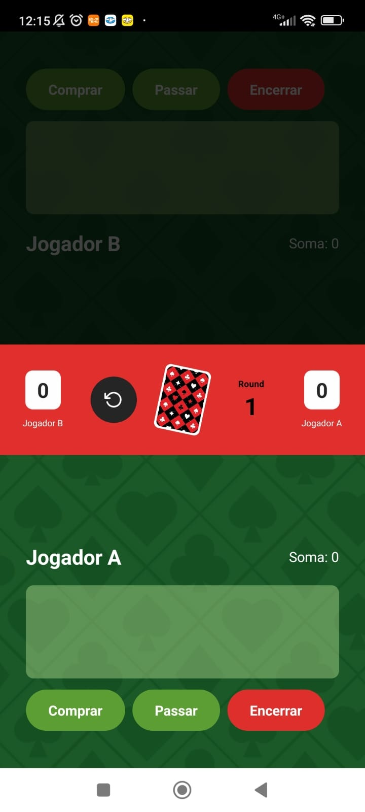

# Jogo 21 – App Mobile com React Native



[](LICENSE)
[](https://expo.dev/)
[](https://reactnative.dev/)
[](https://www.typescriptlang.org/)

Aplicativo mobile desenvolvido como projeto de estudo para simular o clássico jogo “21” (Blackjack). Criado com React Native e Expo, o app foca no uso de lógica de jogo, interface mobile e práticas modernas com TypeScript.

## 🎯 Objetivo do Projeto

Explorar conceitos de desenvolvimento mobile com React Native, integrando funcionalidades visuais, controle de fluxo de jogo e uma experiência interativa no estilo “Blackjack”.

## 🛠 Tecnologias Utilizadas

- **React Native**
- **Expo**
- **TypeScript**
- **React Native Vector Icons**
- **React Native Linear Gradient**
- **Expo Status Bar**

## 🚀 Como Executar o Projeto

1. Clone o repositório:
   ```bash
   git clone https://github.com/douglas-moura/projeto_jogo_21.git

2. Acesse a pasta do projeto:
   ```bash
   cd projeto_jogo_21

3. Instale as dependências:
   ```bash
   npm install

4. Inicie o app:
   ```bash
   npm start

## Licença
Este projeto está licenciado sob a MIT License.

Desenvolvido por Douglas Moura como parte de seus estudos em desenvolvimento mobile com React Native.
